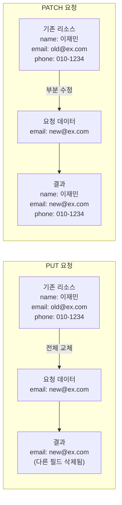

## 사용자 정보 수정 API, PUT으로 할까요? PATCH로 할까요?

REST API를 설계하다 보면 PUT과 PATCH 중 어떤 걸 써야 할지 헷갈릴 때가 많아요. 둘 다 리소스를 수정한다고 하는데, 도대체 뭐가 다른 걸까요?

예를 들어 사용자 프로필 수정 기능을 만든다고 해보세요. 사용자가 이메일만 바꾸고 싶을 때, PUT을 써야 할까요, PATCH를 써야 할까요? 처음엔 그냥 아무거나 써도 되는 줄 알기 쉬운데, 실제로 구현해보면 결과가 완전히 달라요.

## 실제로 어떤 차이가 있을까요?

사용자 프로필 수정 API를 예로 들어 설명해볼게요. 이메일만 바꾸려고 했는데 예상치 못한 일이 벌어질 수 있어요.

### PUT: 전체를 통째로 교체해요

PUT은 리소스 전체를 완전히 새로운 것으로 교체하는 메서드예요. 마치 서류를 수정할 때 기존 서류를 버리고 완전히 새로 작성한 서류로 바꾸는 것과 같아요.


### PATCH: 필요한 부분만 수정해요

PATCH는 정말 편리해요. 수정하고 싶은 부분만 보내면 나머지는 그대로 유지되거든요. 마치 서류에서 특정 부분만 수정펜으로 고치는 것과 같아요.

## 코드로 직접 확인해볼까요?

실제 상황을 시뮬레이션해볼게요. 사용자 정보가 이렇다고 가정해보죠.

### 상황: PUT으로 이메일만 수정하기

```json title="1. 현재 사용자 정보 확인"
GET /users/1
{
  "userName": "이재민",
  "email": "dev@example.com",
  "phone": "010-1234-5678"
}
```

이제 PUT으로 이메일만 수정해볼게요:

```json title="2. PUT으로 이메일만 보내기" {3}
PUT /users/1
{
  "email": "newdev@example.com"  // [!code highlight]
}
```

결과를 확인해보니...

```json title="3. 결과 - 어라? 다른 정보가 사라졌어요!" {3}
GET /users/1
{
  "email": "newdev@example.com"  // [!code ++]
  // userName과 phone이 사라짐! // [!code --]
}
```

보셨나요? PUT을 사용했더니 전달하지 않은 필드들이 모두 사라져버렸어요. 이게 바로 PUT의 특징이에요 - **전체를 교체**하기 때문이죠.

### 상황: PATCH로 이메일만 수정하기

이번엔 PATCH를 사용해볼게요:

```json title="1. 현재 사용자 정보 확인"
GET /users/1
{
  "userName": "이재민",
  "email": "dev@example.com",
  "phone": "010-1234-5678"
}
```

```json title="2. PATCH로 이메일만 수정" {3}
PATCH /users/1
{
  "email": "newdev@example.com"  // [!code highlight]
}
```

```json title="3. 결과 - 완벽해요!" {3-5}
GET /users/1
{
  "userName": "이재민",  // [!code ++] 유지됨
  "email": "newdev@example.com",  // [!code ++] 변경됨
  "phone": "010-1234-5678"  // [!code ++] 유지됨
}
```

훨씬 직관적이죠? PATCH는 우리가 보낸 필드만 수정하고 나머지는 그대로 두어요.

### 그럼 PUT으로도 일부만 수정할 수 있을까요?

네, 가능해요! 하지만 모든 필드를 다 보내야 해요:

```json title="PUT으로 PATCH처럼 동작하게 하기" {3-5}
PUT /users/1
{
  "userName": "이재민",
  "email": "newdev@example.com",
  "phone": "010-1234-5678"
}
```

동작은 하지만... 번거롭죠? 클라이언트가 모든 데이터를 알고 있어야 하고, 실수로 하나라도 빠뜨리면 데이터가 손실돼요.

## 한눈에 보는 PUT vs PATCH



| 구분 | PUT | PATCH |
|------|-----|-------|
| **수정 방식** | 전체 리소스 교체 | 일부 필드만 수정 |
| **필요한 데이터** | 모든 필드 필요 | 변경할 필드만 |
| **누락된 필드** | 삭제됨 ⚠️ | 그대로 유지 ✅ |
| **사용 케이스** | 전체 업데이트, 리소스 생성 | 부분 수정 |
| **멱등성** | 보장 ✅ | 보장하지 않음 ⚠️ |

## 멱등성이 뭐고, 왜 중요할까요?

멱등성(Idempotency)은 같은 작업을 여러 번 반복해도 결과가 달라지지 않는 특성이에요. 예를 들어볼게요:

- **멱등한 작업**: 방 전등 스위치를 "켜기" 위치로 여러 번 올려도 전등은 계속 켜져 있어요
- **멱등하지 않은 작업**: 카운터를 +1 하는 버튼을 누를 때마다 숫자가 계속 올라가요

### PUT은 왜 멱등할까요?

PUT은 전체 리소스를 교체하기 때문에, 같은 데이터로 몇 번을 요청해도 결과가 같아요:

```json title="PUT을 3번 반복 실행" {2-6}
// 1번째 요청
PUT /users/1
{
  "userName": "이재민",
  "email": "new@example.com",
  "phone": "010-1234-5678"
}
// 요청이 성공했다 가정

// 2번째 요청 (동일한 요청)
PUT /users/1
{
  "userName": "이재민",
  "email": "new@example.com",
  "phone": "010-1234-5678"
}
// 요청이 성공했다 가정 (데이터 변화 없음)

// 3번째 요청 (또 동일한 요청)
// 요청이 성공했다 가정 (데이터 변화 없음)
```

몇 번을 실행해도 최종 결과는 항상 같아요. 이게 멱등성이에요!

### PATCH는 왜 멱등하지 않을까요?

많은 개발자들이 "어? PATCH도 같은 요청 반복하면 결과가 같지 않나?" 라고 생각해요. 대부분의 경우엔 맞아요. 하지만 PATCH의 구현 방식에 따라 멱등하지 않을 수 있어요.

### 실제 예시: PATCH가 멱등하지 않은 경우

더 실용적인 예시로 설명해볼게요. 상품의 조회수를 증가시키는 API가 있다고 생각해보세요:

```json title="증가 연산을 포함한 PATCH" {3}
PATCH /products/1
{
  "views": "+1"  // [!code error] 현재 값에서 +1 증가
}
```

이런 경우 매번 요청할 때마다 조회수가 계속 증가해요:

```json title="반복 실행 결과"
// 처음: views = 100
PATCH /products/1 { "views": "+1" }
// 결과: views = 101

// 두 번째: 
PATCH /products/1 { "views": "+1" }
// 결과: views = 102  // [!code error]

// 세 번째:
PATCH /products/1 { "views": "+1" }
// 결과: views = 103  // [!code error]
```

보시는 것처럼 같은 요청을 반복하면 결과가 계속 달라져요. 이래서 PATCH는 멱등성을 보장하지 않는다고 해요.

### 하지만 대부분의 PATCH는 멱등해요

<Callout type="info">
실무에서 사용하는 대부분의 PATCH는 멱등하게 구현돼요:

```json title="일반적인 PATCH 사용 (멱등함)" {3}
PATCH /users/1
{
  "email": "new@example.com" // 특정 값으로 설정  // [!code ++]
}
```

이렇게 특정 값으로 설정하는 방식은 몇 번을 실행해도 결과가 같아서 멱등해요.
</Callout> 

## 실무에서는 언제 무엇을 사용할까요?

실무에서 일반적으로 사용하는 기준을 공유해볼게요:

<Steps>

### PUT을 사용하는 경우
- 클라이언트가 리소스의 전체 상태를 알고 있을 때
- 리소스를 완전히 새로운 것으로 교체하고 싶을 때
- 멱등성이 반드시 보장되어야 할 때
- 예: 설정 전체 업데이트, 문서 전체 교체

### PATCH를 사용하는 경우
- 리소스의 일부만 수정하고 싶을 때
- 클라이언트가 전체 리소스를 알 필요가 없을 때
- 대역폭을 절약하고 싶을 때
- 예: 사용자 프로필 일부 수정, 상태 변경

</Steps>

## 마치며

PUT과 PATCH의 차이를 정리하면:
- **PUT**: "이걸로 전체를 바꿔주세요" 
- **PATCH**: "이 부분만 고쳐주세요"

처음엔 헷갈릴 수 있지만, 실제로 API를 만들고 사용하다 보면 자연스럽게 익숙해져요. 무엇보다 중요한 건 팀 내에서 일관된 규칙을 정해서 사용하는 거예요!

## 참고

- [Idempotent](https://developer.mozilla.org/en-US/docs/Glossary/Idempotent)
- [Use of PUT vs PATCH methods in REST API real life scenarios](https://stackoverflow.com/questions/28459418/use-of-put-vs-patch-methods-in-rest-api-real-life-scenarios/39338329#39338329)
- [자원을 수정하는 HTTP 메서드 - PUT vs PATCH](https://tecoble.techcourse.co.kr/post/2020-08-17-put-vs-patch/)
