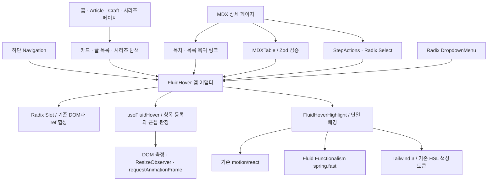

# Fluid Hover

항목별 `:hover` 배경을 하나의 이동하는 하이라이트로 전환한다. 각 그룹 안에서는 항목 사이의 여백에서도 가장 가까운 항목을 표시한다. 그룹 밖으로 나가면 하이라이트가 사라진다.

## 구성과 의존성



`FluidHover`는 서버 컴포넌트가 넘긴 기존 DOM을 Slot으로 감싼다. 기본 등록 대상은 `[data-fluid-hover-item]`이고, Radix 옵션·탐색 항목·표 행은 `itemSelector`를 지정한다. 콘텐츠 데이터나 MDX 파일 읽기는 서버에 남는다.

## 적용 범위

| 영역                                         | 축    | 등록 대상                                     |
| -------------------------------------------- | ----- | --------------------------------------------- |
| `/article`, `/craft`                         | y     | 글 목록, 시리즈 배너                          |
| `/article/series/[id]`, `/craft/series/[id]` | y     | 시리즈 카드                                   |
| 홈                                           | y / x | 프로젝트·기여 카드, 외부 링크 모음            |
| 상세 페이지                                  | y / x | 목차, 복귀 링크, 시리즈 목차와 이전·다음 링크 |
| 하단 탐색                                    | x     | 기존 확대 효과가 있는 탐색·설정 항목          |
| 코드 예제                                    | y / x | Radix 단계 선택 메뉴, 이전·다음 단계 버튼     |
| MDX 표                                       | y     | `tbody tr`                                    |
| 공통 DropdownMenu                            | y     | 메뉴·체크박스·라디오·하위 메뉴 항목           |

본문 인라인 링크의 색상, 코드 복사 버튼의 상태 표시, Twoslash 팝업과 이미지 확대 등 고유 기능을 알리는 호버는 유지한다. 단독 Button/ExternalLink의 기본 스타일도 유지하며, 그룹 안의 단계 버튼은 공유 하이라이트를 사용한다.

## 동작 계약

- 항목 이동은 같은 하이라이트 DOM의 transform과 크기를 갱신한다. 항목 index로 재마운트하지 않는다.
- DOM 항목 집합이 같으면 등록을 반복하지 않는다. 텍스트 셔플이나 하이라이트 자체의 DOM 변경이 재측정/깜빡임을 만들지 않는다.
- 스크롤·리사이즈·항목 측정 완료 후에는 저장된 커서 좌표로 다시 선택한다. 관찰자와 이벤트 리스너는 언마운트 시 정리한다.
- 키보드 포커스는 해당 항목을 즉시 표시한다. OS의 reduced motion에서는 이동을 생략한다. 원본 하이라이트의 짧은 opacity 전환은 유지한다.
- 터치 입력은 마우스 호버 상태를 만들지 않는다. 비활성/숨겨진 항목은 선택에서 제외한다.
- 앱 어댑터는 `gapClick: false`를 사용한다. 여백은 표시만 하며, 실제 링크/버튼 클릭·수정 키·새 탭과 Radix 선택 이벤트는 원래 요소가 처리한다.
- `ul`/`ol`의 하이라이트는 `aria-hidden`인 `li` 안에 두어 목록 DOM을 유지한다. 목차의 활성 섹션/연속 레일은 호버 상태와 별개다.

## 설치와 호환성

공식 레지스트리에서 설치했다:

```sh
pnpm dlx shadcn@latest add https://www.fluidfunctionalism.com/r/use-fluid-hover.json --overwrite --yes
```

출처: [Fluid Functionalism 문서](https://www.fluidfunctionalism.com/docs/fluid-hover), [공식 레지스트리](https://www.fluidfunctionalism.com/r/use-fluid-hover.json).

설치 파일은 `use-fluid-hover.ts`, `fluid-hover-highlight.tsx`, `springs.ts`다. 하이라이트를 프로젝트의 `components/ui` 경로로 옮기고 Motion import만 기존 `motion/react`로 연결했다. 앱별 동작과 색상은 어댑터·props·className으로 구성한다. 패키지와 lockfile 변경은 없다.

원본의 이동 효과에는 Tailwind 4 전용 문법이나 Inter 폰트가 없다. 기존 Tailwind 3에 `bg-hover` HSL 토큰을 매핑하고 Pretendard Variable을 유지한다. 폰트 굵기 애니메이션은 추가하지 않는다.

## 검증

- Node 24.20.0 / pnpm 10.34.5, 최신 `origin/main` 기준의 독립 worktree.
- 전체 단위 테스트 34개 파일 / 323개 테스트 통과. 새 어댑터 테스트는 10개로, 간격 이동 시 DOM 유지, 스크롤, 동적 제거·비활성화, 키보드, 터치, Strict Mode, 지연 마운트, 중첩 그룹을 검증한다.
- TypeScript, 전체 Prettier, 프로덕션 빌드 통과. 빌드의 ESLint 단계도 에러 없이 완료했다. 기존 경고와 원본 훅의 ref cleanup 경고는 남는다.
- Chromium의 글 목록 빠른 왕복 이동 105프레임: 단일 하이라이트 DOM 유지, 최소 opacity 1. 스크롤 후 항목/하이라이트 좌표 일치.
- 홈·Craft·Article/Craft 시리즈·글 상세의 19개 표시 그룹에서 활성 항목과 하이라이트 확인. 목차의 기존 SVG 레일 2개 유지, 표 행 위치 오차 1px 이내.
- 390px 터치 화면에서 링크 이동 성공, sticky hover와 가로 넘침 없음. 다크 모드와 reduced motion 확인.
- Radix Select: 키보드 열기/선택, Escape 후 포커스 복구, 배경 중복 없음. 마지막 단계에서 비활성화된 다음 버튼 대신 이전 버튼으로 호버 이동.
- 로컬 Vercel Insights 스크립트의 404/MIME 콘솔 오류는 로컬 실행 환경에서 발생한다. 마지막 메뉴/단계 검증에서는 JavaScript pageerror가 없었다.

브라우저 확인은 Chromium으로 수행했다. 현재 화면에서 사용하지 않는 DropdownMenu의 하위 메뉴는 공통 어댑터의 지연 마운트 테스트와 타입/빌드 검증으로 확인했다.
