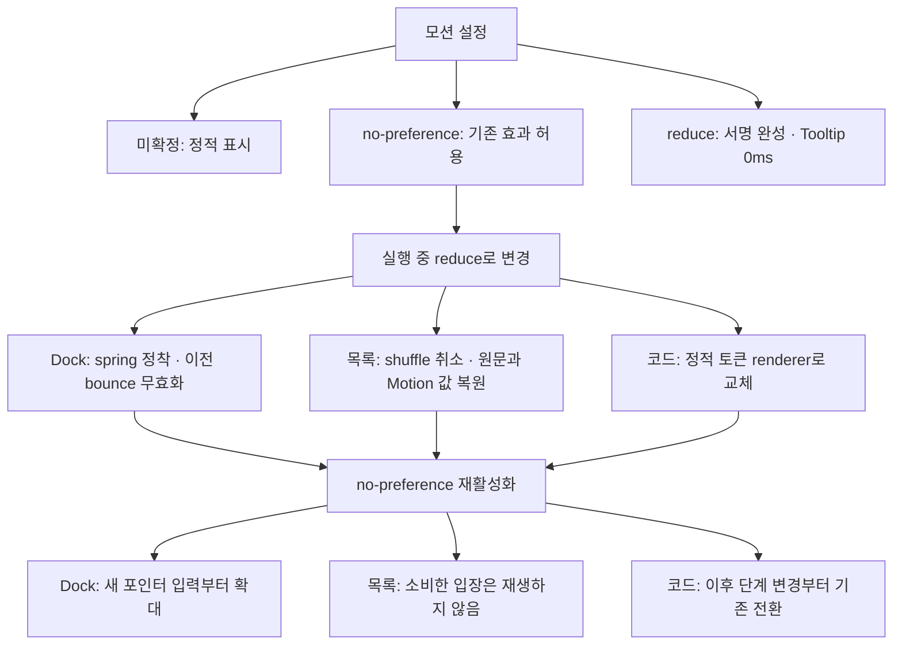

# 모션 설정 변경 시 정적 상태 복원

2026-09-26 · 통합 기준 `origin/main`의 `702d0db`.

애니메이션 감사에서 선정한 001–005를 구현했다. 최초 감사의 Next 14 코드에서 확인한 수정은 Next 15 / React 19 / Motion 12 / Shiki Magic Move 1.0 환경으로 옮겼다. 최신 main에 이미 반영된 Select의 원점·키보드 즉시 전환, FluidHover, 코드 영역 스크롤, 설명 전환 순서를 유지한다.

## 구현과 영향 범위

| 계획           | 적용 영역                          | 완료한 동작                                                                                                                                                                                                                              |
| -------------- | ---------------------------------- | ---------------------------------------------------------------------------------------------------------------------------------------------------------------------------------------------------------------------------------------- |
| 001 서명       | 모든 페이지의 Signature            | reduce에서는 반복 애니메이션을 끄고 `stroke-dashoffset: 0`으로 완성된 서명을 표시한다.                                                                                                                                                   |
| 002 앵커 팝업  | 공통 Tooltip, Select 회귀 검증     | Tooltip에 Radix 원점, 진입 150ms·종료 125ms, `cubic-bezier(0.23, 1, 0.32, 1)`을 적용한다. reduce에서는 duration/delay만 0으로 만들어 Radix의 닫힘 처리를 유지한다. Select는 main의 150ms·기존 곡선과 키보드 즉시 전환을 그대로 검증한다. |
| 003 내비게이션 | 전역 dock의 확대·누름·bounce       | reduce 또는 미확정 상태는 폭 40px·top 0으로 정착한다. 오래된 비동기 bounce를 무효화하고 재활성화 후 새 포인터 입력을 기다린다. 링크·테마·사운드 기능은 유지한다.                                                                         |
| 004 목록 입장  | `/article`, `/craft`의 ArticleItem | 셔플과 Motion controls를 중단하고 최신 props의 원문·opacity·구분선을 복원한다. 취소한 입장은 다시 재생하지 않는다. 서버 렌더링부터 링크와 제목을 표시한다.                                                                               |
| 005 코드 예제  | MagicMove를 사용하는 MDX           | reduce/미확정 상태에서는 강조된 토큰을 정적으로 렌더링한다. 진행 중 설정 변경은 토큰 subtree를 교체해 정착한다. 선택 단계, 설명 정착 순서, 복사 버튼과 가로 스크롤 위치를 유지한다.                                                      |

새 패키지, API, 콘텐츠 데이터, 전역 preference hook 변경은 없다. 일반 모드의 dock spring과 목록 입장 정책, 코드의 750ms duration·3ms stagger를 보존한다.

## 설정 변경 흐름

각 컴포넌트가 기존 `usePrefersReducedMotion`을 읽는다. 아래는 공통 동작 계약이며 새로운 전역 상태 기계를 뜻하지 않는다.



## 구현상 주의점

- Radix Tooltip의 `animation-name`을 없애면 종료 수명주기를 끊을 수 있다. `animate-none` 대신 duration/delay 0을 사용한다. `transition-none`은 배치 원점이 보간되는 현상을 막는다.
- 목록에서 DOM만 복구하면 Motion의 예약된 렌더가 중간 opacity를 다시 쓸 수 있다. `controls.set()`으로 내부 값도 정착시킨다.
- dock의 spring 입력 범위만 고정하면 재활성화 시 잔여 움직임이 생길 수 있다. 새 포인터 이벤트 전에는 숫자 폭을 반환한다.
- Shiki Magic Move 1.0의 상위 React 컴포넌트에는 `animate` prop이 없다. 지원되는 `codeToKeyedTokens`와 `ShikiMagicMoveRenderer animate={false}`를 사용한다. 복사 버튼과 가로 스크롤 wrapper는 교체 범위 밖에 둔다. renderer 교체 후 scroll 위치를 복원하고 새 코드 요소의 크기 관찰을 다시 연결한다.

## 검증

Node 24.20.0 / pnpm 10.34.5. 잠긴 의존성을 새 worktree에 설치했다.

- 구현 전 관련 단위 테스트 25개 중 17개 실패를 재현하고, 구현 후 25개 통과를 확인했다.
- renderer 교체 후 ResizeObserver가 새 코드 요소를 관찰하지 않는 회귀도 RED → GREEN으로 확인했다.
- 전체 단위 테스트: 38개 파일, 349개 통과.
- `pnpm check-types`, `pnpm lint`, `pnpm format:check`, `pnpm build` 통과. 기존 범위 밖 lint 경고는 남는다.
- Chromium 회귀 고유 21개 통과: Select·Tooltip 6개, dock 2개, 목록·SSR 3개, Shiki 10개. 최종 Shiki 수정 후 관련 10개를 재실행하고 변경 없는 나머지 11개의 유효한 결과를 재사용했다.
- 390px viewport에서 모션을 끄고 다시 켜도 코드 `scrollLeft: 100` 유지. 4→5→4, 구문 색·줄 번호·복사, 실행 중 reduce 전환, 키보드 즉시 전환과 포커스 보존을 확인했다.
- 서명의 완성된 획과 `animation-name: none`, 목록·코드 화면을 확인했다. 해당 시각 확인의 JavaScript `pageerror`는 0개였다.
- 기존 Shiki CSS의 reduce 200ms 전환을 실제 브라우저에서 재현해 제거했다. 기존 E2E가 스크롤 표시용 `ScrollTimeline` 두 개를 끝나지 않는 코드 전환으로 집계하던 부분은 코드·활성 설명 영역만 검사하도록 바로잡았다.

브라우저 회귀는 프로덕션 빌드에 대해 실행한다. 해당 spec은 `PLAYWRIGHT_BASE_URL`을 지원하고 기본값은 로컬 3000 / CI 3001이다. 이번 로컬 실행은 설치된 Google Chrome과 3107 포트, 별도 Playwright 설정을 사용했다. 표준 환경에서는 다음 명령을 사용한다.

```sh
pnpm build
pnpm exec playwright test \
  tests/anchored-overlay-motion.spec.ts \
  tests/navigation-motion.spec.ts \
  tests/article-reduced-motion.spec.ts \
  tests/magic-move-reduced-motion.spec.ts \
  tests/magic-move-motion.spec.ts \
  --project=chromium
```

## 별도 범위

실제 터치 기기와 Firefox/WebKit 검증, 영상 녹화 후 프레임 검토, 성능 trace는 수행하지 않았다. rAF 표본은 DOM/computed style 안정성 검사이며 FPS 측정이 아니다.

영상/GIF 재생 정책, 복사 아이콘·학습용 shuffle demo의 모션 대체, 일반 모드 dock 성능과 긴 목록의 index 기반 delay는 별도 개선 대상이다. 이번 결과는 앱 전체 접근성 완료를 뜻하지 않는다.
